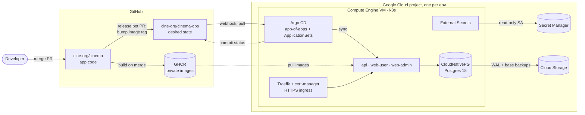

# cinema-ops

Infrastructure and deployment configuration for [`cine-org/cinema`](https://github.com/cine-org/cinema), a cinema booking system (NestJS + Next.js), run entirely through **GitOps**: the desired state of every cluster lives in this repo, and Argo CD pulls it and reconciles. No pipeline runs `kubectl apply` or holds cluster credentials.

## Overview



## Stack

| Layer         | Tools                                                                   |
| ------------- | ----------------------------------------------------------------------- |
| Cloud         | Google Cloud: Compute Engine, Secret Manager, IAM, Cloud Storage        |
| Kubernetes    | k3s (single node, ready to add nodes)                                   |
| GitOps        | Argo CD: app-of-apps, ApplicationSets (Git directory + file generators) |
| Configuration | Kustomize (`base/` + `envs/<env>/`), version-pinned Helm charts         |
| Secrets       | External Secrets Operator + Google Secret Manager                       |
| Ingress, TLS  | Traefik (bundled with k3s), cert-manager + Let's Encrypt                |
| Database      | CloudNativePG operator, Postgres 18                                     |
| Registry      | GitHub Container Registry (private)                                     |
| CI/CD         | GitHub Actions; GitHub Apps for the release bot and for Argo CD         |
| Validation    | `kustomize build` + `kubeconform` (with CRD schemas) on every PR        |

## Environments

| Env        | GCP project         | Domain                       | Deploys                                                          |
| ---------- | ------------------- | ---------------------------- | ---------------------------------------------------------------- |
| staging    | `cinema-stag`       | `*.staging.cine.io.vn`       | Automatically after every merge into `cinema` `main` (`sha-<7>`) |
| production | `cinema-production` | `cine.io.vn`, `*.cine.io.vn` | Manual release `vX.Y.Z`, PR approved by a code owner             |

Each env is its own GCP project: VMs, secrets, IAM and billing are fully separated.

## Delivery

**Staging.** A merge into `cinema` `main` builds the affected app images → `cinema-release-bot` opens a PR here setting `newTag` in `apps/<app>/envs/staging/` and auto-merges it once `ci` passes → Argo CD syncs → the workflow turns green only after Argo CD reports `argocd/staging/<app>` as `success`. A red staging blocks further merges into `main`.

**Production.** The Release workflow re-tags the images staging runs as `vX.Y.Z` (no rebuild) → git tag + GitHub Release → the bot opens a PR updating `apps/<app>/envs/production/` → a code owner approves and merges → Argo CD syncs. Rolling back is a PR that sets `newTag` to the previous version.

## Security

- No secrets in Git: values live in Secret Manager; the cluster reads them through ESO with a service account limited to **Secret Accessor**.
- Least-privilege service accounts and keys: one account per purpose, scoped to the exact resource it needs (for example a single bucket).
- Argo CD reads this repo and the bot opens PRs through **GitHub Apps** (short-lived, per-repo tokens), not personal access tokens.
- Only Argo CD's `/api/webhook` path is exposed to the internet; the UI is reached through an SSH tunnel.
- VMs: key-only SSH, VPC firewall plus `ufw`, fail2ban.
- Every change to `main` goes through a PR and `ci`; production files require a code owner review.

## Layout

```text
bootstrap/   bring up a new env on an empty VM: VM, k3s, Argo CD, root app
infra/       shared infrastructure; each component: app.yaml (chart) + base/ + envs/<env>/
apps/        apps from the cinema repo: base/ + envs/<env>/ (image tags edited by the bot)
docs/        GCP (gce, gsm, gcs) and conventions (git workflow, rulesets)
.github/     manifest validation CI, CODEOWNERS, issue/PR templates
```

Adding an infrastructure component means adding an `infra/<name>/` folder: the ApplicationSet creates an Application for every env that has `envs/<env>/`, with no change to the Argo CD configuration.

## Getting Started

- Build an env from scratch: [docs/gcp/gce.md](docs/gcp/gce.md) → [docs/gcp/gsm.md](docs/gcp/gsm.md) → [bootstrap/README.md](bootstrap/README.md).
- Each component has its own README covering how it works, how to operate it and how to verify it (for example [infra/postgres](infra/postgres/README.md), [apps/api](apps/api/README.md)).
- PR and commit conventions: [docs/conventions/git-workflow.md](docs/conventions/git-workflow.md).
- Validate manifests locally: `bash .github/scripts/validate.sh` (needs `kustomize`, `kubeconform`, `yq`).
